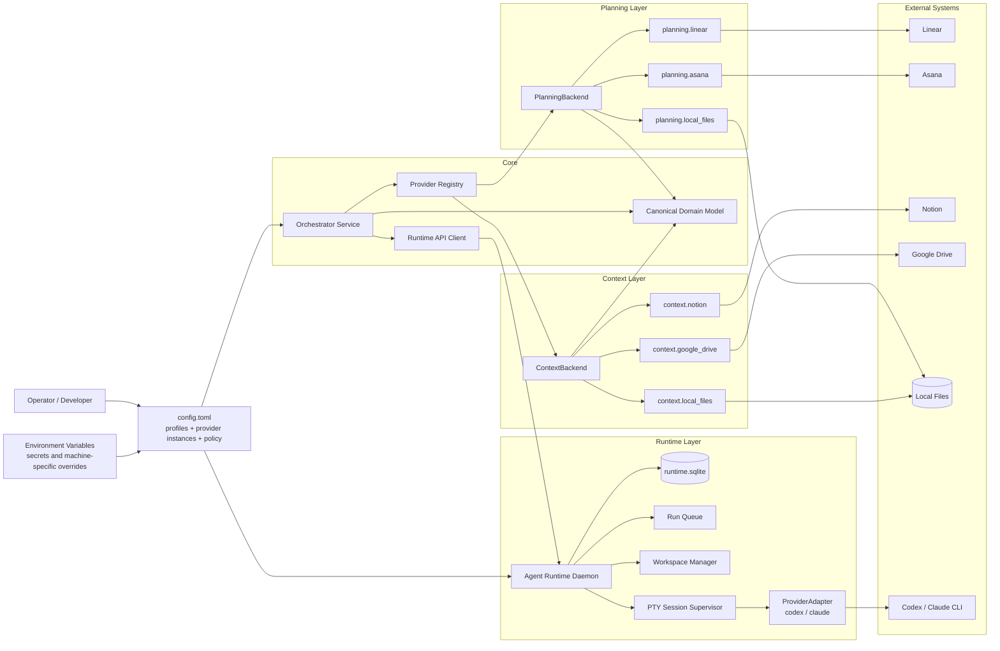
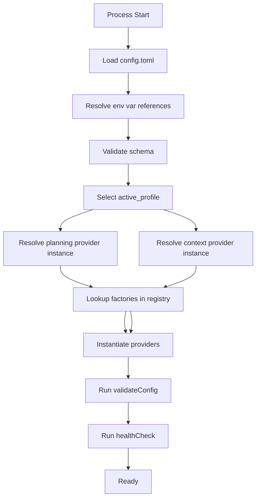
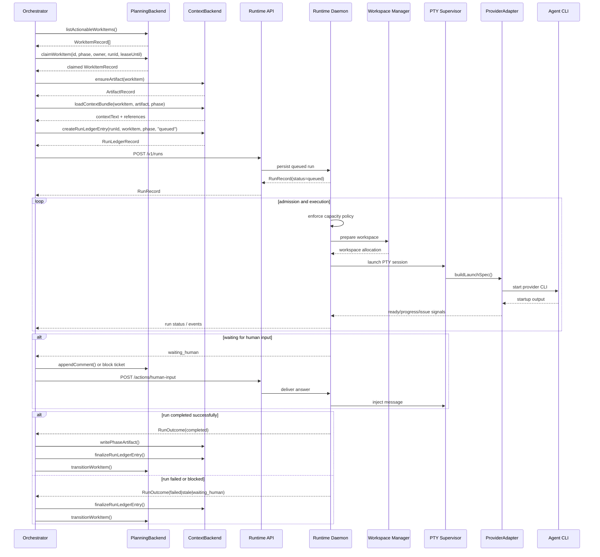
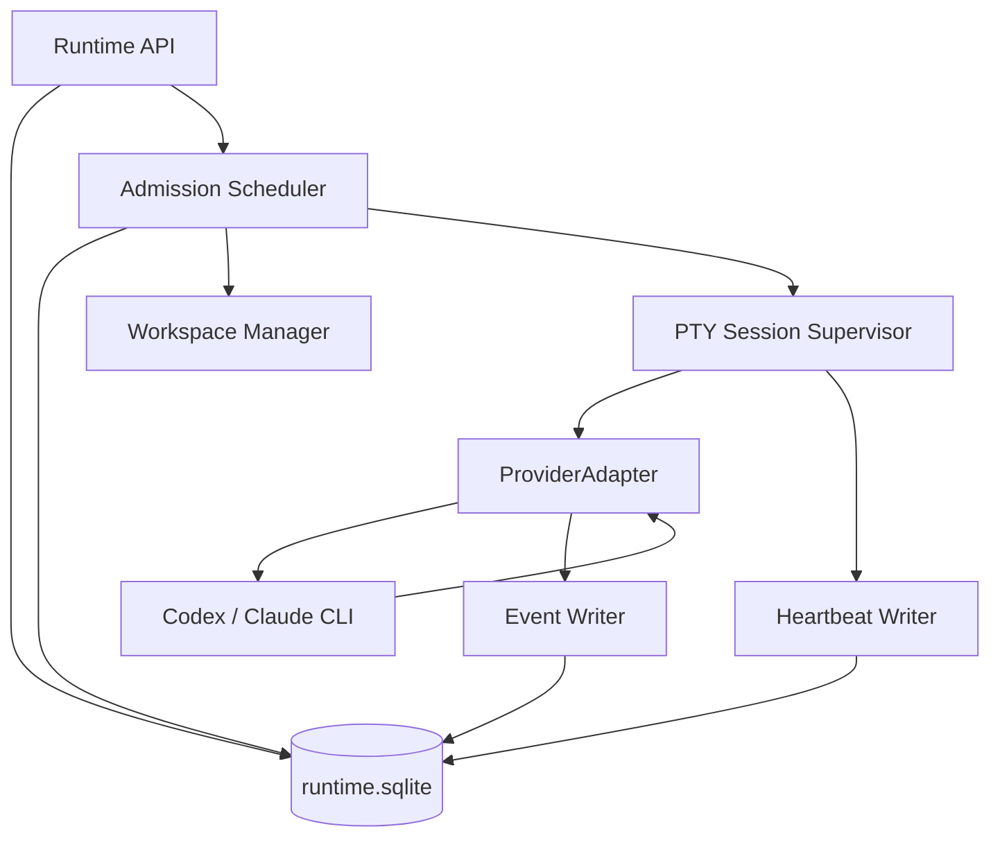
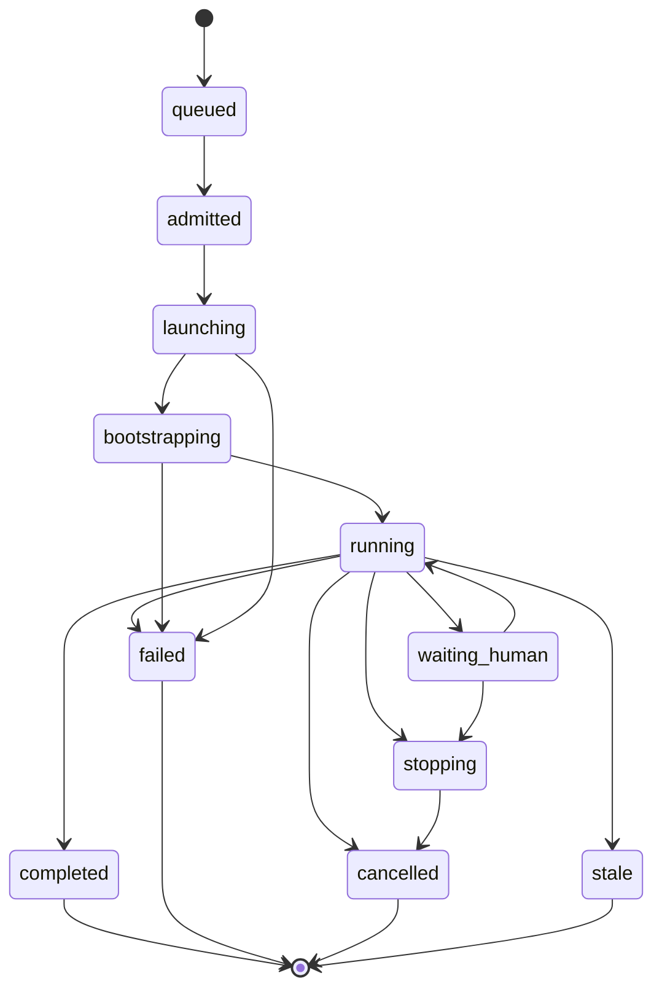

# Architecture

This document is the implementation review draft for the harness architecture.

It pulls together the earlier design docs into one end-to-end view:

- configuration and provider selection
- planning and context abstraction layers
- orchestrator behavior
- runtime daemon behavior
- workspace and persistence boundaries
- local-first deployment shape

The target outcome is a system that can run as:

- `linear + notion`
- `linear + local_files`
- `local_files + local_files`
- future combinations like `asana + google_drive`

without changing the orchestrator core.

## 1. Design intent

The system is split into four major layers:

1. `Configuration layer`
2. `Provider abstraction layer`
3. `Workflow orchestration layer`
4. `Agent runtime layer`

Each layer has one main job:

- configuration decides what concrete providers are active
- configuration also decides which prompt pack and overlays are active
- providers translate between external systems and canonical internal records
- the orchestrator decides what work should happen next
- the runtime daemon decides how agent sessions are launched, supervised, and terminated

That separation is the main architectural safeguard against tight coupling.

## 2. Top-level component diagram



## 3. Layer responsibilities

### 3.1 Configuration layer

This layer answers:

- which planning backend is active
- which context backend is active
- where runtime state lives
- what concurrency and timeout policies apply

It should not contain workflow logic.

### 3.2 Provider abstraction layer

This layer answers:

- how to list and update work items in the active planning system
- how to create and update artifacts in the active context system
- how provider-native data maps into canonical internal records

It should not decide which work item to run next.

### 3.3 Workflow orchestration layer

This layer answers:

- which work item is actionable
- which phase should run
- whether a work item can be claimed
- how runtime outcomes map back into planning and context systems

It should not launch raw subprocesses directly.

### 3.4 Agent runtime layer

This layer answers:

- whether capacity exists for a new run
- how a provider session is launched
- whether a session is healthy, stalled, waiting for human input, or finished
- how workspaces are allocated and cleaned up

It should not decide product workflow transitions.

## 4. Canonical model

The system should reason in canonical internal types, not provider-native objects.

Those canonical records are the stable language between layers:

- `WorkItemRecord`
- `ArtifactRecord`
- `RunLedgerRecord`
- `RunRecord`
- `RunEventRecord`
- `WorkspaceAllocationRecord`

This matters because:

- Linear and Asana do not share one status model
- Notion and Google Drive do not share one artifact model
- local files should still participate with the same contracts

The provider layer is responsible for translation at the edges.

Prompt behavior should follow the same principle:

- base role behavior should be stable
- project-specific behavior should be layered on top through prompt packs and overlays
- experiments should be explicit and traceable

## 5. Provider family model

The system uses two backend families.

### 5.1 Planning backends

Planning backends own:

- work item listing
- work item reads
- claim and lease updates
- workflow status transitions
- operator comment writes

Examples:

- `planning.linear`
- `planning.local_files`
- `planning.asana`

### 5.2 Context backends

Context backends own:

- artifact creation
- artifact retrieval
- context loading for prompts
- phase artifact updates
- run ledger creation and finalization
- evidence append operations

Examples:

- `context.notion`
- `context.local_files`
- `context.google_drive`

### 5.3 Why this split is important

Planning systems and context systems are not symmetric. A single catch-all integration base class would blur those boundaries and create lots of optional methods that are only meaningful for some providers.

Two families keep the contracts narrower and easier to extend.

## 6. Provider selection and config flow



### 6.1 Config shape

The system should use:

- `config.toml`
- named provider instances
- named profiles
- environment-variable references for secrets

That gives open-source users:

- a local-only profile
- a SaaS profile
- a hybrid profile

with one stable config format.

### 6.2 Example profile combinations

```text
Profile "saas"   -> planning.linear + context.notion
Profile "local"  -> planning.local_files + context.local_files
Profile "hybrid" -> planning.linear + context.local_files
```

## 7. End-to-end run lifecycle



## 8. Orchestrator responsibilities in detail

The orchestrator should remain narrow and deterministic.

It should:

- load the active planning and context backends
- poll or wake on planning-system changes
- translate planning state into a target phase
- decide whether a work item is claimable
- create a run request for the runtime daemon
- interpret runtime outcomes
- write phase outputs back to planning and context systems

It should not:

- know provider-native GraphQL or REST shapes
- manage PTYs
- parse raw CLI output
- manage per-provider launch flags

## 9. Planning layer behavior

The planning backend is the system of record for workflow state.

The canonical workflow state for the harness is:

```text
triage
needs_design
needs_plan
ready
in_progress
in_review
blocked
ready_to_merge
done
```

The planning backend must map those canonical statuses onto provider-native fields.

### 9.1 Planning layer invariants

- planning state is authoritative for claimability
- claim/lease fields live in planning, not in context
- comments are additive operational breadcrumbs, not the primary state store
- the orchestrator always re-reads planning state before acting

### 9.2 Local files planning implementation

The local planning backend should behave like a real backend, not a stub:

```text
.harness/
  planning/
    issues/
      ISSUE-001.json
    comments/
      ISSUE-001.md
```

Each JSON file should represent one canonical `WorkItemRecord`.

## 10. Context layer behavior

The context backend is the durable document surface.

It should own:

- artifact page creation
- prompt context assembly
- phase output persistence
- run ledger persistence
- evidence persistence

### 10.1 Context layer invariants

- context is not the claim or lease surface
- context is optimized for durable human-readable records
- context writes should happen after claim and before final workflow transition
- run history should be append-only in normal operation

### 10.2 Local files context implementation

The local context backend should mirror the SaaS structure closely:

```text
.harness/
  context/
    artifacts/
      ISSUE-001.md
    runs/
      run-2026-04-13-001.json
    evidence/
      run-2026-04-13-001.md
```

That gives us a zero-credential deployment that still behaves like a real harness.

## 11. Runtime daemon architecture

The runtime daemon is a host-local service.

It should own:

- queued run persistence
- admission control
- workspace preparation
- PTY session lifecycle
- heartbeat collection
- event recording
- runtime issue normalization

### 11.1 Runtime component diagram



### 11.2 Runtime responsibilities

The daemon should:

- accept idempotent run submissions
- persist `queued` runs
- admit runs when capacity exists
- prepare the required workspace
- launch a PTY-backed provider session
- classify output into normalized runtime signals
- expose status and events back to the orchestrator

It should not:

- decide which Linear or Asana ticket to run
- decide how Notion or local artifacts are structured

## 12. Runtime API

The runtime API should be local-only by default:

- Unix domain socket on macOS/Linux
- named pipe on Windows
- loopback TCP only if needed

Recommended endpoints:

- `POST /v1/runs`
- `GET /v1/runs/:runId`
- `GET /v1/runs`
- `POST /v1/runs/:runId/actions/interrupt`
- `POST /v1/runs/:runId/actions/cancel`
- `POST /v1/runs/:runId/actions/human-input`
- `GET /v1/runs/:runId/events`
- `GET /v1/runs/:runId/stream`
- `GET /v1/capacity`
- `GET /v1/health`

The runtime API is provider-neutral. No Codex- or Claude-specific flags should leak into the public request model.

## 13. Runtime persistence model

The runtime daemon should persist current state and append-only history separately.

### 13.1 Tables

- `runs`
- `run_events`
- `session_heartbeats`
- `workspace_allocations`

### 13.2 Why these tables are enough for v1

`runs`
- current truth for each run

`run_events`
- append-only semantic history

`session_heartbeats`
- liveness evidence separate from semantic events

`workspace_allocations`
- workspace state separate from run state

That separation keeps the daemon easier to reason about during failures.

## 14. Runtime state machine



Important meaning:

- `queued` means accepted but not yet admitted
- `admitted` means a slot and workspace are being reserved
- `bootstrapping` means process exists but is not trusted as ready
- `waiting_human` means the session is live and needs operator input
- `stale` means the daemon no longer has confidence in healthy liveness

## 15. Provider adapters inside runtime

The runtime daemon should still use its own provider adapter family for agent CLIs:

- `codex`
- `claude`

This is different from planning/context providers.

These adapters should own:

- launch command construction
- readiness detection
- output classification
- interrupt behavior
- cancel behavior
- terminal outcome collection

The daemon should not hardcode provider-specific string parsing in the scheduler itself.

## 16. PTY supervision strategy

The runtime should be PTY-first, not tmux-first.

### 16.1 Why PTY first

- interactive CLIs behave more predictably under a PTY than plain pipes
- process lifecycle is easier to supervise directly
- sessions can run headless
- tmux is not required for production automation

### 16.2 Where tmux still fits

tmux should be optional:

- attach/debug surface
- operator mirror
- local observability aid

tmux should not be:

- the canonical session id
- the source of liveness truth
- the runtime state store

## 17. Workspace management

Workspaces should be owned by the runtime daemon, not the orchestrator.

This keeps execution concerns in one place.

### 17.1 Workspace modes

Recommended modes:

- `shared_readonly`
- `ephemeral_worktree`

### 17.2 Phase defaults

Good first-pass defaults:

- `design` -> `shared_readonly`
- `plan` -> `shared_readonly`
- `review` -> `shared_readonly`
- `implement` -> `ephemeral_worktree`
- `merge` -> provider/runtime policy dependent

### 17.3 Workspace invariants

- each `ephemeral_worktree` allocation is owned by one run
- `shared_readonly` allocations may be reused
- cleanup results should be persisted separately from run outcomes

## 18. Admission control and concurrency

The runtime daemon should own concurrency enforcement.

### 18.1 Recommended limits

- global concurrent run limit
- per-provider run limit
- optional per-repo limit

### 18.2 Admission policy

A run should be admitted only when:

- a global slot is available
- a provider slot is available
- the repo policy allows another run
- no non-terminal run already exists for the same work item
- workspace preparation succeeds

### 18.3 Scheduling order

Simple first-pass order:

1. smallest numeric priority
2. oldest creation time

That is enough for v1 without building a more elaborate scheduler.

## 19. Error and issue normalization

Both the orchestrator and runtime should normalize errors instead of leaking provider-native text as their primary contract.

### 19.1 Runtime issue examples

- `provider_not_installed`
- `provider_bad_launch_args`
- `provider_bootstrap_timeout`
- `provider_waiting_human`
- `provider_git_conflict`
- `provider_idle_timeout`
- `provider_nonzero_exit`
- `transport_broken`
- `workspace_prepare_failed`

### 19.2 Planning/context provider issue examples

- `auth_missing`
- `rate_limited`
- `mapping_invalid`
- `artifact_not_found`
- `work_item_not_found`

Normalized issues make retries, UI messaging, and operator notes much easier.

## 20. Local-first deployment shape

The system should ship with a fully usable local mode.

### 20.1 Local profile

```text
planning = planning.local_files
context = context.local_files
runtime = local daemon + sqlite + PTY supervisor
```

### 20.2 What users get in local mode

- no SaaS credentials needed
- local file-based work item storage
- local file-based artifact storage
- the same runtime daemon as other profiles
- the same orchestration behavior as SaaS mode

That is a strong open-source story because users can try the full system before wiring up external tools.

## 21. Implementation boundaries

This is the main boundary map I would hold the codebase to:

### 21.1 Core package

Owns:

- canonical types
- provider interfaces
- config loading and validation
- provider registry

Does not own:

- Linear or Notion API calls
- PTY code

### 21.2 Planning providers package

Owns:

- Linear adapter
- local files planning adapter
- future Asana adapter

Does not own:

- artifact formatting
- runtime session logic

### 21.3 Context providers package

Owns:

- Notion adapter
- local files context adapter
- future Google Drive adapter

Does not own:

- planning claims
- runtime scheduling

### 21.4 Orchestrator package

Owns:

- phase resolution
- claimability logic
- run submission
- result interpretation

Does not own:

- provider-native API shapes
- PTY lifecycle

### 21.5 Runtime package

Owns:

- runtime daemon
- sqlite schema
- API server
- workspace manager
- PTY supervision
- codex/claude runtime adapters

Does not own:

- planning system state transitions
- artifact document structure

## 22. Suggested repository shape

```text
harness/
  config/
    schema.ts
    loader.ts
  core/
    types.ts
    planning-backend.ts
    context-backend.ts
    provider-registry.ts
  providers/
    planning/
      linear/
      local-files/
      asana/
    context/
      notion/
      local-files/
      google-drive/
  orchestrator/
    planner.ts
    phase-resolver.ts
    run-dispatcher.ts
  runtime/
    api/
    daemon/
    db/
    workspace/
    pty/
    provider-adapters/
      codex/
      claude/
  templates/
    local-files/
```

## 23. Review checklist

Before implementation, I would sanity-check:

- Are `PlanningBackend` and `ContextBackend` narrow enough?
- Is the canonical model expressive enough for both Linear and local files?
- Does `config.toml` support SaaS, local, and hybrid without extra schema branches?
- Is the orchestrator free of provider-native logic?
- Is the runtime daemon free of workflow state logic?
- Are local files treated as real providers instead of mocks?
- Is tmux clearly optional rather than foundational?

## 24. Glossary

`Planning backend`
- The provider responsible for workflow objects, claims, and status transitions.

`Context backend`
- The provider responsible for artifacts, evidence, and run-history context.

`Orchestrator`
- The workflow engine that decides what should run next.

`Runtime daemon`
- The local execution service that runs and supervises agent sessions.

`Provider adapter`
- A runtime-only adapter for an agent CLI like Codex or Claude.

`Canonical model`
- The internal provider-neutral records used across the harness core.

`Profile`
- A named selection of one planning backend and one context backend.

`Local files provider`
- A fully supported provider that stores planning or context data in structured local files.

## 25. Recommendation

This architecture is ready to implement if we accept these core commitments:

- two provider families, not one giant integration interface
- `config.toml` profiles and named provider instances
- canonical internal records in the core
- a narrow orchestrator that owns workflow decisions only
- a host-local runtime daemon that owns execution only
- PTY-first supervision with tmux as an optional debug surface
- first-class local file providers for both planning and context

That gives us flexibility for open-source adoption without making the core mushy.
