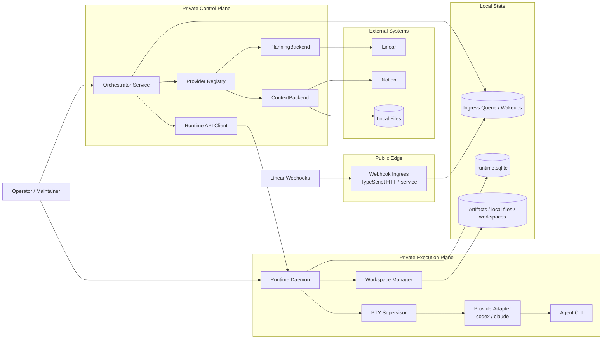
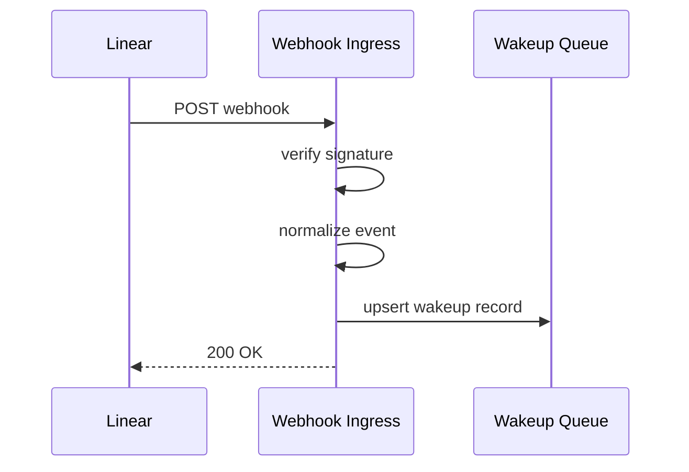
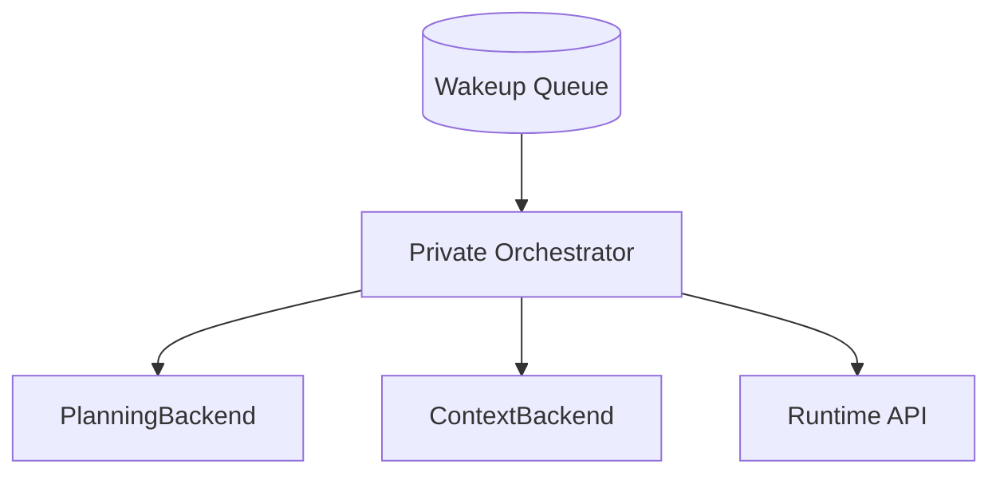
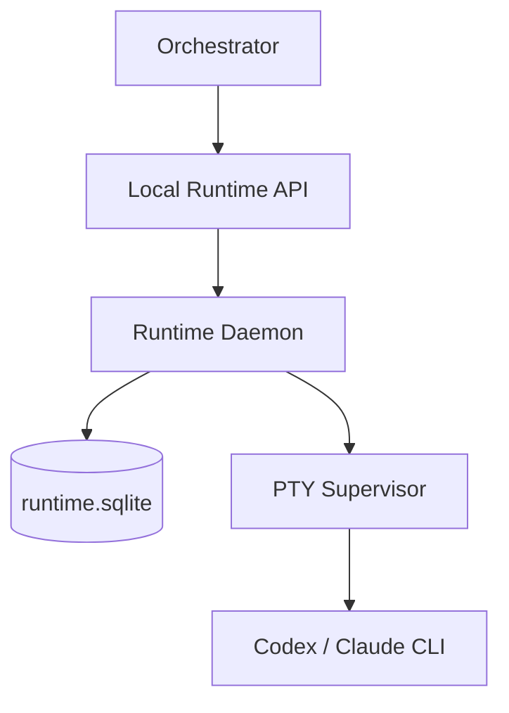
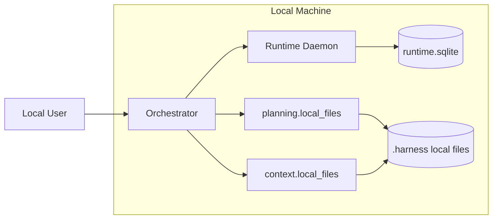
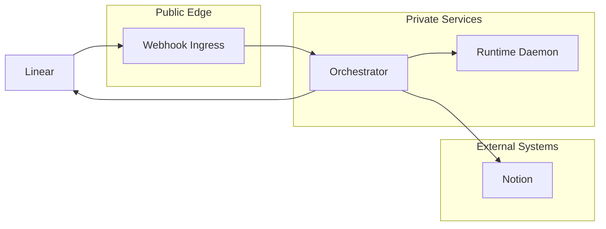

# Deployment Topology

This document defines the recommended deployment topology for the harness.

The main goal is to keep the public surface tiny while keeping the orchestration and execution layers private.

## 1. Recommendation

Split the system into three service zones:

1. `Public webhook ingress`
2. `Private orchestrator`
3. `Private runtime daemon`

And one shared state boundary:

4. `Local database and durable queue state`

This keeps the exposed surface small and lets the operationally risky parts stay off the public edge.

## 2. Topology diagram

## 3. Why this split is the right one

The public-facing webhook receiver is not the risky part of the system. It should stay tiny, boring, and easy to reason about.

The risky parts are:

- workflow decisions
- provider-specific work-item mutation
- PTY supervision
- long-running CLI sessions

Those should remain private.

This split gives us:

- minimal public attack surface
- smaller blast radius if webhook handling breaks
- easier local development
- easier migration between `codex` and `claude`
- clearer operational ownership

## 4. Public webhook ingress

The public ingress should do only five things:

1. receive HTTPS requests
2. verify webhook signatures
3. minimally validate payload shape
4. normalize to a wakeup event
5. persist the event and return quickly

It should not:

- call the runtime daemon
- talk to Notion
- make claim decisions
- launch agent runs
- do expensive reads from Linear

### 4.1 Public ingress diagram

### 4.2 Public ingress design constraints

- stateless except for queue persistence
- fast response path
- no business logic beyond normalization and dedupe
- no dependency on tmux, PTY, or runtime state

### 4.3 Why TypeScript is a good fit here

TypeScript is a strong choice for webhook ingress because this layer is mostly:

- HTTP handling
- schema validation
- signature verification
- queue writes
- typed payload normalization

That is well within the strongest part of the Node/TypeScript ecosystem.

## 5. Private orchestrator

The orchestrator should run in a private network or as a host-local service.

It owns:

- polling and webhook-driven wakeup consumption
- work-item reads and claim decisions
- phase resolution
- context preparation
- run submission to the runtime daemon
- mapping runtime outcomes back into planning/context systems

It should be the only component that understands both:

- planning workflow semantics
- runtime result semantics

### 5.1 Orchestrator boundary diagram

### 5.2 Why the orchestrator should stay private

The orchestrator:

- mutates workflow state
- carries provider credentials
- makes claim and retry decisions
- is a bridge between SaaS providers and local execution

That is not something we want sitting on the public internet by default.

## 6. Private runtime daemon

The runtime daemon should also remain private.

It owns:

- admitted run scheduling
- workspace preparation
- PTY session lifecycle
- agent CLI supervision
- event and heartbeat persistence

It should not be reachable from the public internet.

### 6.1 Runtime boundary diagram

### 6.2 Why the runtime should stay private

This is the layer most likely to deal with:

- stuck sessions
- workspace cleanup problems
- agent prompts and intermediate output
- provider-specific quirks

That is operationally sensitive and should stay behind a local or private boundary.

## 7. Shared state boundaries

There are two practical state boundaries in this deployment shape.

### 7.1 Wakeup queue

This is the bridge between:

- public ingress
- private orchestrator

Properties:

- durable
- compact
- deduped by issue
- transport state only, not workflow truth

### 7.2 Runtime database

This is the bridge between:

- private orchestrator
- private runtime daemon
- operator observability

Properties:

- local durable state
- append-only events plus current run state
- no provider workflow ownership

## 8. Deployment modes

### 8.1 Fully local mode

This is the zero-dependency mode.

Characteristics:

- no public ingress at all
- no webhook receiver needed
- poll local planning files
- best for open-source first-run experience

### 8.2 SaaS hybrid mode

This is the recommended production-oriented shape.

Characteristics:

- public webhook ingress
- private orchestrator/runtime
- webhook-driven wakeups plus poll-based reconciliation

### 8.3 Local-only SaaS development mode

This is a good developer setup:

- no public ingress
- orchestrator polls Linear directly
- runtime stays local
- useful before standing up webhook hosting

## 9. Network boundary rules

Recommended rules:

- only the webhook ingress binds publicly
- orchestrator and runtime bind only to private interfaces, Unix sockets, or named pipes
- runtime API should not be exposed over the public internet
- provider credentials should only be available to components that need them

### 9.1 Credential scoping

`Webhook ingress`
- only webhook verification secret if required

`Orchestrator`
- planning provider credentials
- context provider credentials
- runtime client auth if used

`Runtime daemon`
- agent runtime/provider CLI credentials if needed
- no planning/context write credentials unless absolutely required

This keeps credential spread narrower.

## 10. Failure isolation

This topology improves failure containment.

### 10.1 If the webhook ingress fails

- webhook wakeups may be delayed
- reconciliation polling still recovers work
- runtime sessions are unaffected

### 10.2 If the orchestrator fails

- no new claims or transitions happen
- already running agent sessions can continue
- runtime state and output still persist

### 10.3 If the runtime daemon fails

- workflow state remains intact in planning/context providers
- runs can be marked stale or failed on recovery
- ingress and orchestrator can still accept and queue work

## 11. Observability surface

Operator-friendly observability should also respect these boundaries.

Recommended surfaces:

- ingress logs: request id, verification result, normalized event id
- orchestrator logs: claim decisions, phase resolution, provider writes
- runtime logs: session lifecycle, heartbeats, normalized runtime issues

Do not expose raw runtime logs through the public ingress.

## 12. Security posture

This split gives a sensible default security posture for an open-source project:

- public component is tiny
- heavy logic stays private
- execution layer is never public
- provider secrets are not concentrated at the public edge

That is much better than making the orchestrator or runtime directly internet-facing.

## 13. Recommended implementation path

Build in this order:

1. `Private runtime daemon`
2. `Private orchestrator`
3. `Local files planning/context providers`
4. `Linear + Notion providers`
5. `Public webhook ingress`

Why this order:

- local mode works first
- runtime and orchestrator boundaries stabilize before public deployment
- webhook ingress stays tiny and can be added last

## 14. Recommended TypeScript stance

TypeScript is a good choice for:

- public webhook ingress
- private orchestrator
- config loading and provider wiring
- runtime API server

The only part that still deserves caution is:

- PTY/session supervision internals

So the deployment recommendation is:

- TypeScript for the ingress and control plane
- PTY internals behind an interface so we can swap implementations later if needed

## 15. Review checklist

Before implementation, I would confirm:

- Are we comfortable with the webhook ingress being the only public service?
- Do we want the orchestrator and runtime on the same host at first?
- Is the wakeup queue stored in the same SQLite database or a separate local store?
- Do we want auth between orchestrator and runtime, or is local-socket trust enough in v1?
- Do we want ingress as a separate process from day one, or folded into the orchestrator in local mode only?

## 16. Recommendation

The strongest default deployment is:

- `public`: tiny TypeScript webhook ingress only
- `private`: TypeScript orchestrator
- `private`: runtime daemon with PTY-backed session supervision
- `shared local state`: queue + SQLite + workspaces

That gives us a small public surface, good operational separation, and a clean path from local-only mode to SaaS-integrated mode.
